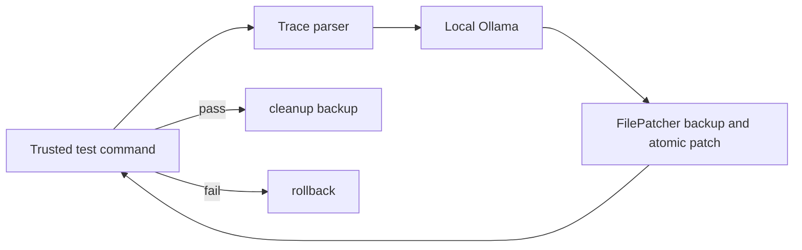

# Architecture

| Module | Responsibility |
| --- | --- |
| `guards` | loopback, paths, subprocess limits |
| `parser` | trace and function extraction |
| `llm` | local Ollama requests only |
| `patcher` | backups and atomic writes |
| `cli` | command interface and orchestration |
